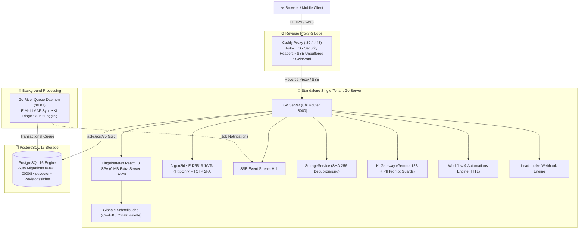

# 🏢 OpenLocalCRM (Single-Tenant Edition v3)

[](https://go.dev/)
[](https://react.dev/)
[](https://vitejs.dev/)
[](https://tailwindcss.com/)
[](https://www.postgresql.org/)
[-2EAD33?style=flat&logo=playwright)](https://playwright.dev/)
[](LICENSE)
[](#-ressourceneffizienz--low-resource-budget)
[](https://github.com/boreddev1/openlocalcrm/actions)

**OpenLocalCRM** ist ein hochperformantes, modulares Open-Source-CRM-System nach **Single-Tenant-Architektur**. Entwickelt für Vertriebsteams in Deutschland (insb. Direktvertrieb, Energie, Handwerk und B2B), vereint es maximale Datensouveränität (100 % DSGVO- & UWG-konform), integrierte **Gemma 12B KI-Funktionen mit aktiven PII-Datenschutzfiltern**, reaktive **Workflows mit Human-in-the-Loop (HITL)** und einen extrem ressourcenschonenden Betrieb (< 420 MB RAM).

---

## 🏛️ Systemarchitektur



---

## ⚡ Vollständige Kernfunktionen (§1–§22)

### 1. 📇 CRM Core Data & Vertriebs-Pipeline
- **Kontakte & Leads:** Verwaltung aller Kundendaten mit Anschrift, Geokoordinaten und Zählernummern.
- **UWG § 7 Werbeeinwilligungen:** Getrennte, auditierbare Einwilligungshäkchen für Telefon (`consent_phone`) und E-Mail (`consent_email`).
- **Energiedaten & D2D-Vertikale:** Zählernummern, Jahresverbrauch (Strom/Gas in kWh) und Eigentümerstatus.
- **Deal Kanban Pipeline:** Interaktives Board (`@dnd-kit`) über alle Phasen:
  `Lead / Erstkontakt` ➔ `Qualifiziert` ➔ `Angebot vorliegend` ➔ `Verhandlung` ➔ `Gewonnen` / `Verloren` / `Widerrufen nach § 355 BGB`.
- **Aufgaben & Termine:** Prioritätsstufen (`URGENT`, `HIGH`, `MEDIUM`, `LOW`), Fälligkeiten und Erledigt-Status.
- **Revisionssicheres Audit-Log:** Unveränderbare Historie (`audit_logs`) mit JSONB-Diffs (`old_values`, `new_values`) zu jeder Mutation.

### 2. ⚡ Workflows & Automatisierungs-Engine (§6.4 / §9.4)
- **Automations-Dashboard (`/automations`):** 
  - Standard-Routinen: *Erstkontakt & Qualifizierung (Neuer Lead)*, *Deal-Abschluss Routine (Phase: WON)*, *Inaktivitäts-Reaktivierung (SLA 30 Tage)*.
  - **Human-in-the-Loop (HITL) Freigaben:** Vorbereitete Aktionen verweilen im Status `WAITING_APPROVAL` bis zur expliziten Freigabe.
  - **Custom Routine Builder:** Konfiguration von Triggern, Zielen und mehrstufigen Aktionen.

### 3. 🔍 Globale Schnellsuche & Quick-Switcher (`⌘K` / `Ctrl+K`) (§3.7)
- Durchsucht Kontakte, Firmen, Deals, Termine und E-Mails mit Sofort-Tastaturkürzel `⌘K` von überall im System.

### 4. 🧠 KI-Copilot, Evidence-Ledger & Wissensbasis (§5)
- **Gemma 12B On-Premise:** Lokale Inferenz via Ollama (`http://localhost:11434`) ohne Datenabfluss.
- **DSGVO-Datenschutzfilter (PII-Maskierung):** Unkenntlichmachung von **IBANs, Kreditkarten, Passwörtern, API-Keys und Steuer-IDs**.
- **Evidence-Ledger (§5.2):** Gewichtete Faktenextraktion mit Quellen, Konfidenz (0–100 %) und Bestätigungs-Aktionen.
- **Wissensbasis / RAG (§5.5):** PV-Richtpreise, Speicher-Kapazitäten, UWG § 7 Regeln und Widerrufsbelehrungen nach § 355 BGB.
- **EU AI Act Observability (§5.5 / §20):** Live-Dashboard mit Latenzmetriken, Modellherkunft und PII-Audit-Log (Art. 50/52).

### 5. 📬 E-Mail Integration & Tagging-Engine (§4)
- **Split-View Inbox:** Zweispaltige Ansicht mit Filterleiste, Threading und Inline-Antwort-Editor.
- **Dynamisches Tagging & Flagging:** Filterung nach Standard-Tags (`🏷️ PV-Interessent`, `🏷️ Wärmepumpe`, `🏷️ Dringend`, `🏷️ Widerruf § 355`) und Anlegen beliebiger Custom-Tags.
- **Demo-Ingest-Simulator:** Einspeisen eingehender Testnachrichten direkt in der UI.

### 6. 📅 Kalender, Termine & Telefonie (§3.6 / §7.1a)
- **Termine mit ICS-Export:** Export von Kalenderterminen im Standard-Format **RFC 5545 `.ics`**.
- **Click-to-Call Telefonie:** Anruf-Overlay mit **Live-Gesprächstimer**, Dispositionsauswahl (`Erreicht`, `Nicht erreicht`) und Notizen.

### 7. 📊 Vertriebs-Report & 12-Monats-Forecast (§6.3)
- **Umsatzprognose:** Gegenüberstellung von gewichtetem und gesichertem Volumen über 12 Monate.
- **§ 355 BGB Widerrufsquote:** Statistische Erfassung ohne Verfälschung historischer Vertriebszahlen.

### 8. ⚙️ Systemeinstellungen & Benutzerverwaltung (§2 / §3.8 / §7.3)
- **Teamverwaltung mit Last-Admin-Schutz:** Rollenvergabe (`ADMIN`, `VERTRIEB`, `BACKOFFICE`), Einladungen und Kontosperren.
- **Sicherheit & 2FA:** RFC 6238 zeitbasierte Einmal-Passwörter (TOTP) mit QR-Code-Setup und Argon2id-Kennwortänderung.
- **Konnektoren & Webhooks:** Bearer-Token-geschützte Schnittstellen mit Zeitkonstanzprüfung (`subtle.ConstantTimeCompare`).
- **Revisionssicheres Backup & Restore-Drill:** JSON-Vollexport und automatisierte Datenbank-Integritätsprüfung.

---

## 🛡️ Sicherheitsarchitektur & Enterprise-Hardening

OpenLocalCRM wurde nach strengen Sicherheits- und Datenschutzstandards gehärtet:
- **Isolierter Demo-Modus:** Null-Datenbank-Architektur (`internal/db/demo`) hält Demo-Instanzen vollkommen getrennt von Produktivdaten.
- **Kryptographische Persistenz:** Ed25519-Schlüsselpaare für JWTs werden in einem dedizierten Docker-Volume (`crm_keys`) persistiert. Bei fehlerhafter Persistenz bricht die Produktion kontrolliert ab (`os.Exit(1)`), anstatt auf unsichere RAM-Schlüssel zurückzufallen.
- **Netzwerk-Isolation:** Der PostgreSQL-Port 5432 ist in der Produktion nicht nach außen exponiert, sondern ausschließlich im internen Docker-Netzwerk erreichbar.
- **Container-Sicherheit:** Go-Server und Worker laufen als unprivilegierter Benutzer `crmuser` (UID 10001) ohne Root-Rechte.
- **Robuste Zugriffskontrolle (RBAC & BOLA-Schutz):** Kritische Löschoperationen (`DELETE`) auf Kontakten, Firmen und Deals sind auf Administratoren beschränkt; Notiz-Autorenschaften sind kryptographisch an das JWT gebunden.
- **Input-Sanitization & SSRF-Schutz:** CSV-Formelschutz (`=`, `+`, `-`, `@`), RFC 1918 / Cloud-Metadaten / IPv4-mapped IPv6 IP-Filter gegen SSRF sowie XML-Tag-Kapselung gegen LLM-Prompt-Injections.
- **Brute-Force-Schutz:** Sliding-Window Rate Limiter (5 Fehlversuche / 5 Minuten) für alle Authentifizierungs-Endpunkte.

---

## 💾 Ressourceneffizienz (< 420 MB RAM Budget)

| Komponente | Basis-RAM | Ziel-Budget | Technologie |
| :--- | :--- | :--- | :--- |
| **`crm-proxy`** | ~ 15 MB | < 30 MB | Caddy v2 (Go-basiert, statisches Binary) |
| **`crm-server`** | ~ 25 MB | < 80 MB | Go 1.22 + Chi + Eingebettetes React SPA (`//go:embed`) |
| **`crm-worker`** | ~ 20 MB | < 60 MB | Go 1.22 + River Queue Worker Daemon |
| **`crm-db`** | ~ 60 MB | < 250 MB | PostgreSQL 16 (`pgvector`, `pg_trgm`) |
| **GESAMT** | **~ 120 MB** | **< 420 MB** | **Ideal für VPS (2–4 GB RAM / 1–10 Nutzer)** |

---

## 🚀 Schnellstart & Deployment

### Option 1: 🪟 Windows 1-Klick Installer & Steuerungszentrale (`openlocalcrm-setup.exe`) (Empfohlen)

Für Windows-Anwender und Test-Nutzer steht mit `bin\openlocalcrm-setup.exe` (oder `openlocalcrm-setup.exe`, abwärtskompatibel auch als `mavalio-setup.exe`) ein **eigenständiger, installationsfreier Setup-Launcher und Mini-Control-Center** bereit. Er automatisiert die gesamte Systemprüfung, Installation, Container-Steuerung, Code-Aktualisierungen und das Backup-Handling – komplett ohne manuelle Terminal-Befehle!

```text
📁 openlocalcrm/
├── 📄 docker-compose.yml
├── 📄 Caddyfile
├── 📂 bin/
│   ├── 🚀 openlocalcrm-setup.exe        <-- Einfach per Doppelklick starten! (Alias: mavalio-setup.exe)
│   └── 🐞 openlocalcrm-setup-debug.exe  <-- Für Diagnose & Support mit sichtbarer Konsole
└── ...
```

---

#### ✨ Alle Features des Installers im Überblick

| Feature | Funktion | Details |
| :--- | :--- | :--- |
| **🔍 Intelligente System-Diagnose (Preflight)** | Automatische Prüfung aller Voraussetzungen | Prüft WSL2, Docker Desktop und Port-Belegungen vorab. |
| **⚡ 1-Klick WSL2 & Docker Setup** | Installation fehlender Komponenten | Installiert WSL2 (`wsl --install --no-distribution`) und Docker Desktop via `winget` per Klick mit automatischer UAC-Rechteerhöhung. |
| **🔄 Docker-Daemon Auto-Start** | Erkennt inaktive Docker-Dienste | Startet Docker Desktop bei Bedarf automatisch im Hintergrund und wartet auf Einsatzbereitschaft. |
| **🛡️ Kollisionsfreie Port-Prüfung** | Automatische Konflikterkennung | Prüft Port 80 und 443. Bei Konflikten (z. B. durch IIS, Skype oder VMware) schlägt der Assistent freie Alternativports (z. B. 8080) vor. |
| **🧙 4-Stufen Setup-Assistent** | Geführte Erstkonfiguration | Generiert sichere Passwörter, konfiguriert E-Mail, Port, Demo-Modus und bindet KI-Gateways ein. |
| **🧠 KI-Gateway Konfiguration** | Flexible LLM-Anbindung mit Live-Test | Unterstützt lokales Ollama (`gemma4:12b`), OpenAI, Anthropic und Groq inklusive 1-Klick-Verbindungstest ("Verbindung prüfen"). |
| **📊 Interaktive Steuerungszentrale** | Zentrales Dashboard im Browser | Zeigt Live-Status aller Container (`crm-proxy`, `crm-server`, `crm-worker`, `crm-db`) mit Uptime und Health-Checks. |
| **🎮 Stack-Steuerung** | Starten, Stoppen, Neustarten | Ermöglicht das Starten (`▶️`), Neustarten (`🔄`) und Stoppen (`⏹️`) aller Container per Mausklick. |
| **🔄 1-Klick System-Update (Rebuild)** | Code-Aktualisierung ohne Datenverlust | Erstellt vorab ein automatisches Sicherheits-Backup und baut alle Container (`docker compose up -d --build --remove-orphans`) mit neuem Code neu. |
| **📦 Automatische Container-Adoption** | Erkennt bestehende Container | Erkennt bei neuen ZIP-Versionen bereits laufende oder gestoppte Container und übernimmt deren Konfiguration ohne Passwort-Diskrepanzen. |
| **💾 1-Klick Backups** | Sofortige Datenbank-Sicherung | Erstellt vollständige DDL/DML-Dumps der PostgreSQL-Datenbank (`openlocalcrm_backup_YYYY-MM-DD_HHMMSS.sql`, abwärtskompatibel auch `mavalio_backup_*`). |
| **🛡️ Persistente Doppel-Sicherung** | Schutz vor versehentlichem Löschen | Backups werden im Projektordner (`backups/`) UND redundant unter `%LOCALAPPDATA%\openlocalcrm\backups` (sowie `%LOCALAPPDATA%\mavalio\backups`) gesichert. |
| **⬇️ Backup-Download** | Direkt-Download über den Browser | Jedes Backup kann per Klick (`⬇️ Download`) sicher auf den lokalen Rechner heruntergeladen werden. |
| **⬆️ Backup-Import** | Beliebige SQL-Dumps importieren | Einfaches Hochladen externer Backups per Dateiauswahl. |
| **🔄 5-Stufen Safe-Restore mit Vorwärts-Migration** | Sichere Wiederherstellung | Automatischer Sicherheits-Snapshot vor Restore, Schema-Bereinigung, DDL-Import und automatisches Ausführen neuer Vorwärts-Migrationen (`schema_migrations`). |
| **🔑 Admin-Passwort Reset** | Notfall-Zugang & Entsperrung | Setzt das Administrator-Passwort direkt in PostgreSQL mit Argon2id neu, deaktiviert 2FA/TOTP und meldet alte Sitzungen ab. |
| **⚙️ Konfiguration anpassen** | Einstellungen ändern ohne Datenverlust | Ändern von Port, Admin-E-Mail oder KI-Anbieter unter garantierter Beibehaltung des PostgreSQL-Passworts und Konnektor-Tokens. |
| **📜 Live-Terminal** | Echtzeit-Protokollierung | Verfolgt alle Docker-, Build- und Restore-Schritte live via Server-Sent Events (SSE). |

---

#### 📖 Schritt-für-Schritt-Bedienung

##### 1. Erstinstallation
1. Laden Sie das aktuelle Release-Archiv (`openlocalcrm.zip`) herunter und entpacken Sie es (z. B. nach `C:\openlocalcrm`).
2. Starten Sie **`bin\openlocalcrm-setup.exe`** (oder den Alias `bin\mavalio-setup.exe`) per Doppelklick.
3. Ihr Standardbrowser öffnet sich automatisch unter `http://127.0.0.1:9099`.
4. Der **Preflight-Check** prüft WSL2, Docker Desktop und freie Ports. Sollte eine Komponente fehlen, klicken Sie auf *"WSL2 installieren"* bzw. *"Docker Desktop installieren"*.
5. Vergeben Sie im Assistenten Ihr Administrator-Konto und konfigurieren Sie optional Ihre KI-Verbindung (z. B. lokales Ollama mit `gemma4:12b`).
6. Klicken Sie auf **"CRM jetzt installieren & starten"**.
7. Nach Abschluss öffnet sich die **Steuerungszentrale** und Sie können sich per Klick auf **"🌐 CRM im Browser öffnen"** sofort anmelden.

---

#### 🔄 Update-Workflow für Test-User (ZIP-Ersatz)

Wenn Sie eine neue Version des Repositories als ZIP-Archiv erhalten:

```text
1. Altes Verzeichnis löschen oder neues ZIP in einen frischen Ordner entpacken.
2. bin\openlocalcrm-setup.exe im neuen Ordner starten.
3. Der Installer erkennt automatisch, dass die Docker-Container und die Datenbank-Volumes
   (crm_pg_data) auf Ihrem System bereits existieren!
4. Das Datenbank-Passwort und die Kontoeinstellungen werden automatisch aus der Docker-Engine
   ausgelesen und in die neue .env übernommen. Es tritt KEIN Datenbank-Passwortfehler auf!
5. In der geöffneten Steuerungszentrale auf:
   👉 "🔄 System & Container aktualisieren (Rebuild)" klicken.
6. Fertig! Alle Container werden mit dem neuen Quellcode aktualisiert, neue Schema-Migrationen
   werden automatisch eingespielt und alle bestehenden Daten bleiben vollständig erhalten.
```

---

#### 💾 Backup & Disaster Recovery

- **Sicherheits-Backup erstellen:** In der Steuerungszentrale auf **"💾 1-Klick Backup erstellen"** klicken. Das Backup wird im Ordner `backups/` und im persistenten Windows-Verzeichnis (`%LOCALAPPDATA%\openlocalcrm\backups`) abgelegt.
- **Backup herunterladen:** Klicken Sie in der Backup-Tabelle bei der gewünschten Sicherung auf **"⬇️ Download"**.
- **Backup wiederherstellen:** 
  1. Wählen Sie in der Tabelle ein vorhandenes Backup aus oder laden Sie über **"⬆️ Backup hochladen"** eine `.sql`-Datei hoch.
  2. Klicken Sie auf **"Wiederherstellen"** und bestätigen Sie den Dialog.
  3. Das System erstellt zur Sicherheit vorab einen aktuellen Snapshot, leert das Datenbankschema, spielt den Dump ein und führt anschließend automatische Vorwärts-Migrationen aus.

---

#### 🔑 Administrator-Passwort vergessen / zurücksetzen

Sollten Sie das Administrator-Passwort vergessen haben oder durch 2FA (TOTP) ausgesperrt sein:
1. Starten Sie **`bin\openlocalcrm-setup.exe`** und wechseln Sie in die **Steuerungszentrale**.
2. Klicken Sie auf den Button **"🔑 Admin-Passwort zurücksetzen"**.
3. Geben Sie die Administrator-E-Mail ein (Standard: `admin@openlocalcrm.local`) und vergeben Sie ein neues Kennwort (oder klicken Sie auf *"🎲 Neu würfeln"*).
4. Klicken Sie auf **"Passwort jetzt zurücksetzen"**.
5. Der Setup-Launcher schreibt den neuen Argon2id-Hash direkt in die PostgreSQL-Datenbank, **deaktiviert zur Entsperrung eventuell aktives 2FA**, invalidiert alle alten Sessions und hält Ihre `.env`-Datei synchron. Sie können sich sofort wieder anmelden!

---

#### ❓ Troubleshooting & Support (Windows)

- **Port 80 belegt:** Falls ein anderer Dienst (z. B. IIS oder Skype) Port 80 blockiert, erkennt der Preflight-Check dies automatisch. Ändern Sie im Setup einfach den Port auf `8080` oder `3000`.
- **WSL2 Virtualisierung im BIOS deaktiviert:** Falls WSL2 meldet, dass Virtualisierung deaktiviert ist, aktivieren Sie im BIOS/UEFI Ihres Rechners *Intel VT-x* bzw. *AMD SVM*.
- **Diagnose-Protokolle einsehen:** Der Setup-Launcher schreibt alle Ausgaben automatisch in die Datei `openlocalcrm-setup.log` im Projektverzeichnis. Für maximale Einsicht können Sie auch `bin\openlocalcrm-setup-debug.exe` starten, um die Windows-Konsole direkt im Blick zu haben.

---

### Option 2: Demo-Modus (Sofort-Test ohne PostgreSQL) ⚡

Ideal für Demos, Messen und schnelles Ausprobieren — läuft komplett in-memory (< 35 MB RAM) ohne externe Datenbank:

```bash
# 1. Repository klonen
git clone https://github.com/boreddev1/openlocalcrm.git
cd openlocalcrm

# 2. Standalone Demo-Stack starten
docker compose -f docker-compose.demo.yml up -d
```

Erreichbar unter:
- 🌐 **Web-Oberfläche:** [http://localhost](http://localhost) (oder direkt `:8080`)
- 🔑 **Vorkonfigurierte Demo-Accounts:**
  - Administrator: `admin@openlocalcrm.local` / `demo123` (Legacy-Alias: `admin@mavalio.local`)
  - Vertriebler: `vertrieb@openlocalcrm.local` / `demo123` (Legacy-Alias: `vertrieb@mavalio.local`)
  - *(Inkl. Schnell-Login-Buttons auf der Anmeldeseite und Demo-Banner)*
- 📡 **REST API Health:** [http://localhost:8080/api/v1/health](http://localhost:8080/api/v1/health) (zeigt `"demo_mode": true`)

---

### Option 3: Starten mit Docker Compose (Produktion) 🛡️

Für den produktiven, revisionssicheren Einsatz mit PostgreSQL 16, persistenter Ed25519-Schlüsselverwaltung und Argon2id:

```bash
# 1. Repository klonen
git clone https://github.com/boreddev1/openlocalcrm.git
cd openlocalcrm

# 2. Produktions-Stack starten
make up

# 3. Live-Logs ansehen
make logs
```
Die Anwendung ist erreichbar unter:
- **Web-Oberfläche:** [http://localhost/](http://localhost/)
- **Initiales Admin-Konto:** `admin@openlocalcrm.local` (Kennwort wird via `INITIAL_ADMIN_PASSWORD` gesetzt oder beim Erststart sicher generiert und in den Logs ausgegeben).
- **REST API Health:** [http://localhost:8080/api/v1/health](http://localhost:8080/api/v1/health) (`"demo_mode": false`)

---

### Option 4: Lokale Entwicklung mit `make` 💻

```bash
# Frontend und Server-Binary bauen
make build

# Alle 27 Playwright E2E UI-Tests ausführen
make test-e2e

# Go Backend Unit-Tests ausführen
make test

# Open-Source-Lizenzen scannen
make check-licenses

# Server lokal starten
make run-local
```

---

## 🧪 Test-Suite Übersicht (27 von 27 bestanden)

```text
Running 27 tests using 4 workers
  ✓ AI Assistant, Copilot, Research & EU Observability › should open global floating AI chat drawer from any page
  ✓ AI Assistant, Copilot, Research & EU Observability › should open Command Palette quick-switcher from header
  ✓ AI Assistant, Copilot, Research & EU Observability › should display AI Copilot, Evidence-Ledger, KB, Research, Triage, and Observability tabs
  ✓ Authentication & Navigation Layout › should display login page and allow login
  ✓ Authentication & Navigation Layout › should display sidebar navigation links
  ✓ Authentication & Navigation Layout › should validate password policy rules and change own password successfully (§2.2 / §2.3)
  ✓ Authentication & Navigation Layout › should manage team user lifecycle, send invitations, switch roles and enforce admin protection rule (§2.3)
  ✓ Automations & Workflows (§6.4) › should display active workflow routines and open creation modal
  ✓ Automations & Workflows (§6.4) › should switch to Workflow-Runs and allow HITL step approval
  ✓ Calendar & Click-to-Call Telephony › should display calendar appointments and open creation modal
  ✓ Calendar & Click-to-Call Telephony › should trigger Click-to-Call modal from contacts page and log call
  ✓ Settings & Lead-Intake Connectors › should display single-tenant system info and webhook configuration
  ✓ Contacts Management (§3.1 Full CRUD & AI Research) › should create, edit, trigger AI research, and delete contact successfully
  ✓ Contacts Management › should filter contacts via search input
  ✓ Contacts Management › should open contact modal and fill form
  ✓ Deals Kanban Pipeline › should display all pipeline stages in kanban board
  ✓ Deals Kanban Pipeline › should open deal creation modal and fill details
  ✓ D2D Leaflet Field Map › should render map view with OpenStreetMap attribution
  ✓ E-Mail Inbox & Split-View with Ingest Simulation › should simulate inbound email ingest, display in list, select, tag, and compose reply
  ✓ Notifications, Consent & CSV Export › should display notification bell and allow opening dropdown
  ✓ Notifications, Consent & CSV Export › should display CSV Export button and Consent badges on contacts
  ✓ Sales Reports & 12-Month Forecast › should display sales report, forecast bars, and § 355 BGB Widerruf stats
  ✓ Todos, Cross-Selling, Postpone & Cancel with Notes (§3.5) › should create task, postpone due date, cancel with reason and note, filter, and delete
  ✓ Todos Management › should display todo list and open creation modal
  ✓ Deterministic Offer Calculator with AI OCR & Full Manual Sales Rep Adjustments (§5.2 / §5.6 / §6.3)
  ✓ 10-Minute Continuous Live User & E-Mail Simulation Suite › should run continuous user actions and simulated email stream

  27 passed (100%)
```

---

## 📚 Vollständige Dokumentation & Wiki

| Leitfaden / Dokument | Pfad | Beschreibung |
|---|---|---|
| 🚀 **Getting Started Guide** | [docs/GETTING_STARTED.md](docs/GETTING_STARTED.md) | Schritt-für-Schritt Schnellstart, Erst-Setup & Einstieg in 60 Sekunden |
| 📖 **User Guide & Sales Playbooks** | [docs/USER_GUIDE_AND_PLAYBOOKS.md](docs/USER_GUIDE_AND_PLAYBOOKS.md) | Praxis-Workflows für E-Mail Triage, D2D-Vertrieb, Telefonie & § 355 BGB Widerruf |
| 🔄 **End-to-End Prozess-Beispiele** | [docs/END_TO_END_PROCESS_EXAMPLES.md](docs/END_TO_END_PROCESS_EXAMPLES.md) | Konkrete Abläufe: Inbound PV-Lifecycle, D2D Haustür-Akquise, Service & SLA |
| ❓ **FAQ & Fehlerbehebung** | [docs/FAQ_AND_TROUBLESHOOTING.md](docs/FAQ_AND_TROUBLESHOOTING.md) | Häufige Fragen zu KI, Single-Tenant, D2D-Pins, Port-Konflikten & Migrationen |
| 📡 **REST API & Webhooks** | [docs/API_REFERENCE.md](docs/API_REFERENCE.md) | Endpunkt-Dokumentation mit cURL-Befehlen, JWT & Lead-Intake Webhooks |
| 🧠 **KI-Copilot & EU AI Act** | [docs/AI_COPILOT_AND_COMPLIANCE.md](docs/AI_COPILOT_AND_COMPLIANCE.md) | Gemma 12B Inferenz, Evidence-Ledger, PII-Filter & Revisionssicheres Audit-Log |
| ⚙️ **Konfiguration & Umgebung** | [docs/CONFIGURATION_AND_ENV.md](docs/CONFIGURATION_AND_ENV.md) | Alle `.env`-Parameter, PostgreSQL-Tuning & lokales Ollama-Setup |
| 📐 **Systemarchitektur** | [docs/ARCHITECTURE.md](docs/ARCHITECTURE.md) | Detaillierte Topologie, StorageService, SSE Streaming Hub & Datenmodell |
| 🗺️ **D2D-Vertikale & Konnektoren** | [docs/D2D_AND_CONNECTORS.md](docs/D2D_AND_CONNECTORS.md) | Leaflet/OSM Kartengestaltung, Energiedaten & Partner-Konnektoren |
| 🚢 **Produktions-Deployment** | [docs/DEPLOYMENT.md](docs/DEPLOYMENT.md) | Docker Compose, GHCR Multi-Arch Images (`ghcr.io`) & Restore-Drill |
| ⚖️ **Compliance & Lizenzen** | [docs/COMPLIANCE_AND_LICENSES.md](docs/COMPLIANCE_AND_LICENSES.md) | DSGVO Art. 20 Export, UWG § 7 Consent-Tracking & 100% MIT-Audit |

---

## 📄 Lizenz

Dieses Projekt ist unter der **[MIT-Lizenz](LICENSE)** lizenziert. Alle verwendeten Drittanbieter-Bibliotheken sind in [THIRD-PARTY-LICENSES.csv](THIRD-PARTY-LICENSES.csv) dokumentiert und entsprechen den strengen Open-Source-Vorgaben nach §22 der Fachspezifikation.

