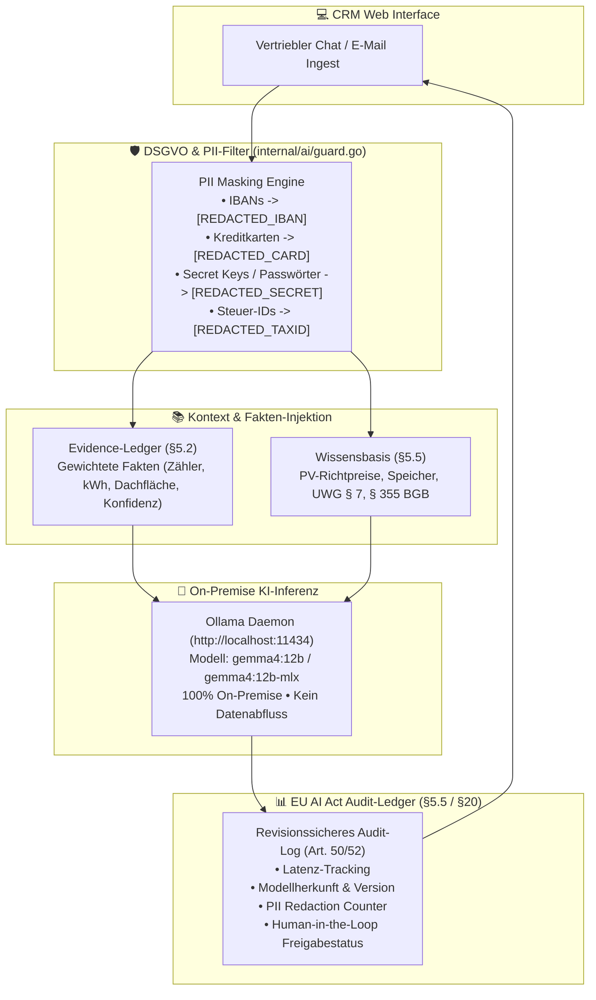

# 🧠 KI-Copilot, Evidence-Ledger & EU AI Act Compliance

Dieses Dokument beschreibt die Architektur, Sicherheitsmechanismen, Wissensbasis und regulatorische Konformität der KI-Funktionen in **OpenLocalCRM (Single-Tenant v3)**.

---

## 🏛️ Architektur der KI-Engine



---

## 1. 🛡️ PII-Datenschutzfilter & Prompt-Guards

Vor jedem Senden von Text an das Sprachmodell werden sensible personenbezogene Daten automatisch nach strengen regulären Ausdrücken maskiert:

```go
// internal/ai/guard.go
func (g *Guard) SanitizeInput(text string) string {
    sanitized := ibanRegex.ReplaceAllString(text, "[REDACTED_IBAN]")
    sanitized = creditCardRegex.ReplaceAllString(sanitized, "[REDACTED_CREDIT_CARD]")
    sanitized = secretKeyRegex.ReplaceAllString(sanitized, "$1: [REDACTED_SECRET]")
    return sanitized
}
```

### Erkannte Datenkategorien:
- **IBANs:** Europäische Bankverbindungen (z. B. `DE89 3704 0044...`).
- **Kreditkarten:** 16-stellige Kreditkartennummern aller Emittenten.
- **Passwörter & API-Schlüssel:** Token mit Präfixen wie `sk_live_`, `api_key=`, `secret=`.
- **Steuer-IDs:** 11-stellige deutsche Steuer-Identifikationsnummern.

---

## 2. 📋 Evidence-Ledger (Gewichtete Fakten §5.2)

Das Evidence-Ledger speichert alle aus Gesprächen, E-Mails und Web-Recherchen extrahierten Fakten strukturiert mit Konfidenzwerten:

| Kunde / Firma | Fakt & Attribut | Quelle | Konfidenz | Status & HITL |
|---|---|---|---|---|
| **Energie Südwest GmbH** | Dachfläche: 350 m² Süd | Web-Recherche & Luftbild | 94 % | Bestätigt ✅ |
| **Dr. Michael Weber** | Jahresverbrauch: 45.000 kWh | E-Mail Anfrage | 98 % | Bestätigt ✅ |
| **Sabine Mustermann** | Heizsystem: Ölheizung (1998) | D2D Setter-Gespräch | 88 % | Neu (Zur Prüfung) |
| **Solarpark Rhein-Main** | Zählerkasten: Modernisiert 2023 | Vor-Ort Notiz | 92 % | Neu (Zur Prüfung) |

---

## 3. ⚖️ Regulatorische Compliance (EU AI Act & DSGVO)

### EU AI Act Konformität (Art. 50 & 52)
1. **Transparenz:** Jede vom System generierte Antwort ist eindeutig als KI-unterstützt gekennzeichnet (*"Generiert mit Gemma 12B"*).
2. **Menschliche Aufsicht (Human-in-the-Loop):** Keine KI-Entscheidung führt selbsttätig zu rechtsverbindlichen Verträgen oder Mail-Versendungen. Jeder Schritt verharrt im Status `WAITING_APPROVAL`.
3. **Auditierbarkeit:** Zeitstempel, Token-Anzahl, Latenz und Modellbezeichnung werden für jede Inferenz unveränderbar in der Datenbank protokolliert.

### UWG § 7 (Einwilligungs-Management)
- Saubere Trennung von `consent_phone` (ausdrückliches Opt-In für B2C-Telefonie) und `consent_email`.
- Audit-Trail für Zeitstempel und Herkunft der Einwilligung.

### § 355 BGB (Widerrufs-Behandlung)
- 14-tägige Fristerfassung bei Verbraucherverträgen.
- Automatische Erfassung von Widerrufen im Reporting ohne historische Sales-Verzerrung.
