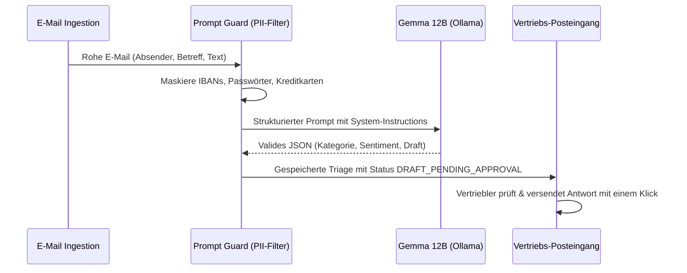

# 🧠 KI-Gateway & Prompt Guards

OpenLocalCRM enthält ein integriertes KI-Gateway, das speziell für **kompakte Open-Source-Modelle (wie Gemma 12B)** optimiert ist und strenge **Prompt Guards / PII-Filter** erzwingt.

---

## 1. PII-Datenschutzfilter (Prompt Guards)

Bevor Textinhalte an das LLM weitergeleitet werden, filtert `internal/ai/guard.go` sensible Daten heraus:

| Sensibler Datentyp | Regex / Heuristik | Ersetzung |
| :--- | :--- | :--- |
| **IBAN** | `\b[A-Z]{2}[0-9]{2}(?:[ ]?[0-9]{4}){4,7}...\b` | `[REDACTED_IBAN]` |
| **Kreditkarten** | `\b(?:\d{4}[ -]?){3}\d{4}\b` | `[REDACTED_CREDIT_CARD]` |
| **Passwörter / API-Keys** | `(?i)(api_key\|password\|secret\|token)...` | `[REDACTED_SECRET]` |

---

## 2. E-Mail Triage & Human-in-the-Loop Entwürfe



---

## 3. Lokale Ausführung mit Ollama (Gemma 12B)

1. **Ollama installieren:** [ollama.com](https://ollama.com)
2. **Gemma 12B herunterladen:**
   ```bash
   ollama pull gemma4:12b
   ```
3. **CRM-Konfiguration in `.env`:**
   ```dotenv
   AI_PROVIDER=ollama
   OLLAMA_BASE_URL=http://localhost:11434
   OLLAMA_MODEL=gemma4:12b
   ```
