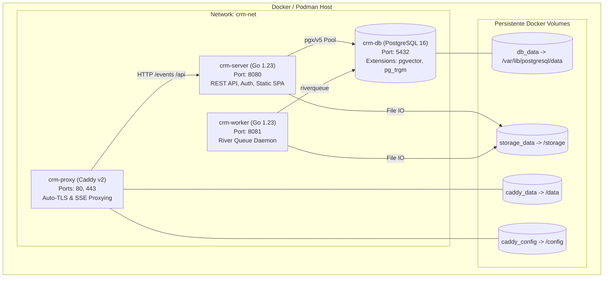

# 📐 Architektur-Dokumentation: OpenLocalCRM (Single-Tenant v3)

Diese Dokumentation beschreibt die technische Architektur, Prozessflüsse, Sicherheitsmechanismen und Ressourcenlimits von **OpenLocalCRM**.

---

## 1. Architektur-Prinzipien

1. **Single-Tenant Datensouveränität:** Jede Organisation / jedes Vertriebsteam betreibt eine vollständig isolierte Instanz (eigene Datenbank, eigene Volumes, keine Mandantenmischung).
2. **Ultra-Low Memory Budget:** Der gesamte Stack ist darauf optimiert, mit **unter 450 MB RAM** zuverlässig auf günstigen VPS-Instanzen (2–4 GB RAM) zu laufen.
3. **Zero-Reflection & 100 % Typsicherheit:** Die Datenzugriffsschicht verwendet `jackc/pgx/v5` mit `sqlc` für kompilierte, überprüfte SQL-Abfragen ohne ORM-Overhead.
4. **Zero Extra Server RAM für Frontend:** Das React 18 SPA wird im Go Binary per `//go:embed` bereitgestellt (kein Node.js / Next.js Server-Daemon zur Laufzeit erforderlich).

---

## 2. Container-Topologie



---

## 3. Speicherabstraktion & Dateiverwaltung

Der Dateizugriff erfolgt über das Interface `internal/storage/StorageService`:

```go
type StorageService interface {
    Save(ctx context.Context, filename string, r io.Reader) (StoredFile, error)
    Open(ctx context.Context, storagePath string) (io.ReadSeekCloser, error)
    Delete(ctx context.Context, storagePath string) error
}
```

- **Sicherheit:** Pfade werden sanitisiert; Path-Traversal-Versuche (`../`) werden sofort blockiert.
- **Deduplizierung:** Dateien werden nach ihrem SHA-256 Hash gespeichert. Identische E-Mail-Anhänge belegen nur einmal physischen Speicherplatz.
- **Struktur:** Dateien werden in Datumsordnern (`YYYY/MM/<hash>.<ext>`) abgelegt.

---

## 4. Echtzeit-Architektur (Server-Sent Events)

Für Live-Updates (neue E-Mails, zugewiesene Leads, Deal-Statusänderungen) wird HTTP/2 Server-Sent Events (SSE) verwendet:
- **Client-Verbindung:** `GET /events/stream`
- **Streaming-Hub:** `internal/sse/Hub` verwaltet aktive Client-Channels.
- **Caddy-Konfiguration:** Pufferung ist für `/events/*` deaktiviert (`flush_interval -1`), um Latenzen von < 10 ms zu garantieren.
