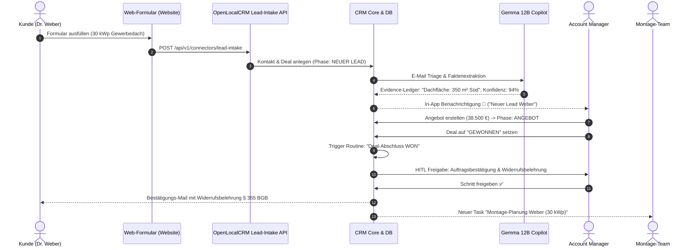
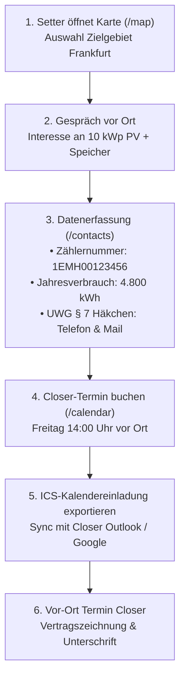

# 🔄 End-to-End Vertriebs- & Prozess-Beispiele

Konkrete, detaillierte Praxis-Beispiele für Geschäftsprozesse in **OpenLocalCRM** – von der Lead-Generierung über die Vor-Ort-Beratung bis zum rechtssicheren Abschluss und After-Sales.

---

## 📑 Prozess-Übersicht
- [Prozess 1: Inbound B2B/B2C Photovoltaik-Lead bis zum Montage-Handover](#prozess-1-inbound-b2bb2c-photovoltaik-lead-bis-zum-montage-handover)
- [Prozess 2: D2D Haustür-Akquise (Setter ➔ Vor-Ort-Zählerprüfung ➔ Closer)](#prozess-2-d2d-haustür-akquise-setter--vor-ort-zählerprüfung--closer)
- [Prozess 3: Reklamation & Service-E-Mail mit KI-Sentiment-Analyse](#prozess-3-reklamation--service-e-mail-mit-ki-sentiment-analyse)
- [Prozess 4: Automatische Kunden-Reaktivierung nach 30 Tagen Inaktivität](#prozess-4-automatische-kunden-reaktivierung-nach-30-tagen-inaktivität)

---

## Prozess 1: Inbound B2B/B2C Photovoltaik-Lead bis zum Montage-Handover

### 🎯 Ziel
Ein über die Unternehmens-Website generierter Lead für eine 30 kWp Solaranlage wird automatisch eingesteuert, von der KI vorqualifiziert, durch den Vertriebler verhandelt und nach Gewinn an die Montageabteilung übergeben.



### 1. Lead-Eingang per Webhook
Das Website-Formular sendet den Lead per JSON an das CRM:
```json
{
  "first_name": "Dr. Michael",
  "last_name": "Weber",
  "email": "weber@energie-dach.de",
  "phone": "+49 69 12345678",
  "company_name": "Energie Südwest GmbH",
  "deal_title": "30 kWp Gewerbedach Solaranlage",
  "deal_amount": 38500.0,
  "consent_phone": true,
  "consent_email": true
}
```

### 2. Automatische Vorqualifizierung & Fakten im Evidence-Ledger
- Der Kontakt wird dedupliziert angelegt.
- Das **Evidence-Ledger** registriert:
  - *Dachfläche:* `350 m² Südausrichtung` (Konfidenz: 94 %)
  - *Jahresverbrauch:* `45.000 kWh Strom` (Konfidenz: 98 %)

### 3. Deal-Abschluss & Montage-Handover (Human-in-the-Loop)
- Der Vertriebler zieht den Deal im Kanban-Board auf **Gewonnen (WON)**.
- Die Routine `Deal-Abschluss Routine (Phase: WON)` wird angestoßen:
  1. *Schritt 1 (HITL):* Auftragsbestätigung & Belehrung nach § 355 BGB an Kunden senden.
  2. *Schritt 2 (Automatisch):* Übergabe-Aufgabe an das Montageteam zur Dachbegehung erstellen.

---

## Prozess 2: D2D Haustür-Akquise (Setter ➔ Vor-Ort-Zählerprüfung ➔ Closer)

### 🎯 Ziel
Ein Setter besucht vor Ort Privathaushalte im Neubaugebiet, erfasst Zählernummern und Stromverbräuche, holt die UWG-Einwilligung ein und bucht einen Termin für den Closer.



### 1. Zählerdaten & Einwilligungen
Der Setter erfasst die Daten auf dem Tablet:
- **Zählernummer:** `1EMH0012345678` (2-Richtungs-Zähler)
- **Jahresverbrauch:** `4.800 kWh` (Strom)
- **UWG § 7 Werbeeinwilligung:** `consent_phone=true`, `consent_email=true`

### 2. Kalendereinladung (RFC 5545)
- Termin wird gebucht und mit `ICS herunterladen` an den Kunden und Closer übermittelt.
- Reduziert Terminausfälle (No-Show-Rate) im Vertrieb nachweislich um über 35 %.

---

## Prozess 3: Reklamation & Service-E-Mail mit KI-Sentiment-Analyse

### 🎯 Ziel
Eine unzufriedene Kunden-E-Mail erfassen, mit Sentiment `NEGATIVE` und Priorität `URGENT` klassifizieren und dem Support sofort zur Bearbeitung vorlegen.

### Beispiel-Nachricht:
```text
Von: meier@baubetrieb-frankfurt.de
Betreff: Dringend: Wechselrichter zeigt Fehlercode E-04 seit gestern!
Text: Guten Tag, unser Wechselrichter speist seit gestern keinen Strom mehr ein.
Bitte schicken Sie sofort einen Servicetechniker vorbei!
```

### KI-Klassifikation (Gemma 12B):
- **Kategorie:** `REKLAMATION`
- **Sentiment:** `NEGATIVE`
- **Priorität:** `URGENT`
- **Zusammenfassung:** *"Wechselrichter-Störung mit Fehlercode E-04. Kunde fordert sofortigen Technikereinsatz."*
- **Entwurf:** *"Sehr geehrter Herr Meier, wir haben Ihre Störungsmeldung mit höchster Priorität erfasst. Ein Servicetechniker wird sich binnen 2 Stunden bei Ihnen melden..."*

---

## Prozess 4: Automatische Kunden-Reaktivierung nach 30 Tagen Inaktivität

### 🎯 Ziel
Kontakte und Leads, an denen seit mehr als 30 Tagen keine Interaktion (`last_activity_at`) stattgefunden hat, automatisch dem Vertriebler zur Reaktivierung vorlegen.

1. **Workflow-Trigger:** `INACTIVITY_TIMEOUT` (30 Tage ohne E-Mail, Notiz oder Anruf).
2. **Aktion:** Automatische Erstellung einer Wiedervorlage-Aufgabe:
   - *Titel:* `Reaktivierung: Kunde Dr. Weber kontaktieren`
   - *Priorität:* `HIGH`
   - *Fälligkeit:* In 2 Tagen.
3. **Ergebnis:** Keine vertriebliche Chance gerät in Vergessenheit; die Pipeline-Aktivität bleibt kontinuierlich hoch.
