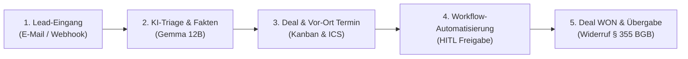

# 🚀 Getting Started with OpenLocalCRM (Single-Tenant)

Willkommen bei **OpenLocalCRM**! Diese Anleitung führt Sie Schritt für Schritt von der ersten Installation bis zu Ihrem ersten erfolgreichen Deal-Abschluss.

---

## 📋 Inhaltsverzeichnis
1. [Systemvoraussetzungen](#1-systemvoraussetzungen)
2. [Schnellstart in 60 Sekunden (Docker)](#2-schnellstart-in-60-sekunden-docker)
3. [Erstanmeldung & Setup-Assistent](#3-erstanmeldung--setup-assistent)
4. [Tagesgeschäft: Die ersten 5 Schritte im CRM](#4-tagesgeschäft-die-ersten-5-schritte-im-crm)
5. [Tastaturkürzel & Navigation](#5-tastaturkürzel--navigation)

---

## 1. Systemvoraussetzungen

OpenLocalCRM ist auf minimale Ressourcennutzung optimiert (**< 420 MB RAM** für den gesamten Stack):

| Komponente | Mindestanforderung | Empfohlen für Produktion |
|---|---|---|
| **CPU** | 1 Core | 2 vCPUs |
| **Arbeitsspeicher (RAM)** | 1 GB RAM | 2–4 GB RAM |
| **Festplattenspeicher** | 5 GB SSD | 20 GB NVMe |
| **Betriebssystem** | Linux / macOS / Windows WSL2 | Ubuntu 24.04 LTS / Debian 12 |
| **Software** | Docker & Compose v2+ | Docker Engine 24+ |

---

## 2. Schnellstart: Demo vs. Produktion

### Option A: Demo-Modus (Empfohlen für schnelles Testen) ⚡

Startet den CRM-Server vollständig im RAM (< 35 MB RAM), ohne dass eine PostgreSQL-Datenbank oder Konfiguration erforderlich ist:

```bash
# Standalone Demo starten
docker compose -f docker-compose.demo.yml up -d
```

- 🌐 **Web-Workspace:** [http://localhost](http://localhost) (oder Port `8080`)
- 🔑 **Vorkonfigurierte Accounts:**
  - **Administrator:** `admin@openlocalcrm.local` / `demo123` (Legacy-Alias: `admin@mavalio.local`)
  - **Vertriebsmitarbeiter:** `vertrieb@openlocalcrm.local` / `demo123` (Legacy-Alias: `vertrieb@mavalio.local`)
  - *(Nutzen Sie die 1-Klick Login-Knöpfe direkt auf der Anmeldeseite)*
- 📡 **REST API Healthcheck:** [http://localhost:8080/api/v1/health](http://localhost:8080/api/v1/health) (`"demo_mode": true`)

---

### Option B: Produktiv-Stack (Revisionssicher mit PostgreSQL) 🛡️

Für den Produktiveinsatz mit persistenter PostgreSQL-Datenbank, Ed25519-Schlüsselverwaltung und Argon2id-Passwort-Hashing:

```bash
# 1. Repository klonen
git clone https://github.com/boreddev1/openlocalcrm.git
cd openlocalcrm

# 2. Produktions-Stack starten
make up

# 3. Live-Status überprüfen
make logs
```

Nach wenigen Sekunden ist das CRM einsatzbereit:
- 🌐 **Web-Workspace:** [http://localhost](http://localhost) (bzw. Port `80` / `443`)
- 📡 **REST API Healthcheck:** [http://localhost:8080/api/v1/health](http://localhost:8080/api/v1/health) (`"demo_mode": false`)

---

## 3. Erstanmeldung & Setup-Assistent

1. Öffnen Sie Ihren Browser unter `http://localhost`.
2. Sie sehen den Login-Bildschirm der **Single-Tenant Edition**:
   - **Administrator-E-Mail:** `admin@openlocalcrm.local`
   - **Initiales Kennwort:** Wird beim Erststart aus der Umgebungsvariable `INITIAL_ADMIN_PASSWORD` gelesen oder zufällig generiert und in den Server-Logs ausgegeben.
3. Nach dem Login befinden Sie sich direkt im **Vertriebs-Dashboard** mit Live-Pipeline, offenen Todos und KI-Hinweisen.
4. **Empfohlene Sicherheitsschritte:**
   - Navigieren Sie zu **Einstellungen (`/settings`)** ➔ Tab **Sicherheit & 2FA**.
   - Ändern Sie das initiale Administrator-Passwort.
   - Aktivieren Sie die Zwei-Faktor-Authentifizierung (TOTP) mit Ihrer Authenticator-App (z. B. Google Authenticator, 1Password oder Aegis).

---

## 4. Tagesgeschäft: Die ersten 5 Schritte im CRM



### Schritt 1: Eingehende E-Mail prüfen (`/inbox`)
- Navigieren Sie zu **E-Mail Posteingang**.
- Sie sehen alle eingehenden Kundenanfragen im Split-View.
- **Demo-Test:** Klicken Sie oben rechts auf `Test-E-Mail simulieren`, um eine echte PV-Kundenanfrage einzuspeisen.
- Die KI analysiert den Text automatisch, extrahiert Absenderdaten und schlägt Antwortentwürfe vor.

### Schritt 2: Deal in der Kanban-Pipeline anlegen (`/deals`)
- Wechseln Sie auf **Deals & Pipeline**.
- Klicken Sie auf `+ Neuer Deal`.
- Geben Sie Titel (z. B. *30 kWp Gewerbedach Solaranlage*), Auftragswert (*38.500 €*) und Phase (*Angebot vorliegt*) ein.
- Verschieben Sie Deals bequem per Drag-and-Drop zwischen den Stufen.

### Schritt 3: Vor-Ort-Termin buchen & ICS exportieren (`/calendar`)
- Öffnen Sie den **Kalender**.
- Erstellen Sie einen Beratungstermin für Ihren Außendienst (Closer/Setter).
- Klicken Sie beim Termin auf `ICS herunterladen`, um eine standardisierte Kalendereinladung (**RFC 5545**) für Outlook, Google Kalender oder Apple Kalender zu erhalten.

### Schritt 4: KI-Copilot nach Kunden & Strategien fragen (`/agent`)
- Klicken Sie unten rechts auf den **schwebenden KI-Copilot-Button** oder drücken Sie `⌘K`.
- Fragen Sie den Assistenten:
  > *"Wie schließe ich den PV-Deal bei Dr. Michael Weber am besten ab?"*
- Der Copilot greift live auf das **Evidence-Ledger** und die **Wissensbasis** zu und liefert konkrete Handlungsempfehlungen.

### Schritt 5: Automatisierungs-Freigabe erteilen (`/automations`)
- Öffnen Sie **Automatisierung & Workflows**.
- Im Tab `Workflow-Läufe & HITL Freigaben` sehen Sie automatisch vorbereitete E-Mail-Entwürfe und Aufgaben.
- Klicken Sie auf `Schritt freigeben` (**Human-in-the-Loop**), um den nächsten Prozessschritt sicher auszuführen.

---

## 5. Tastaturkürzel & Navigation

| Tastenkombination | Aktion |
|---|---|
| <kbd>⌘</kbd> + <kbd>K</kbd> / <kbd>Ctrl</kbd> + <kbd>K</kbd> | **Globale Schnellsuche (Command Palette)** öffnen |
| <kbd>ESC</kbd> | Modales Fenster / Command Palette schließen |
| <kbd>Enter</kbd> | Suche ausführen oder Tag-Eingabe bestätigen |
