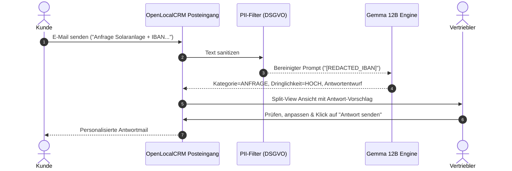

# 📖 Benutzer-Handbuch & Praxis-Playbooks

Dieses Handbuch beschreibt die konkreten Arbeitsabläufe (Playbooks) im Vertriebsalltag mit **OpenLocalCRM**.

---

## 📑 Übersicht der Playbooks
- [Playbook 1: Eingehende Lead-E-Mail & KI-Triage](#playbook-1-eingehende-lead-e-mail--ki-triage)
- [Playbook 2: D2D-Feldvertrieb & Vor-Ort Lead-Erfassung](#playbook-2-d2d-feldvertrieb--vor-ort-lead-erfassung)
- [Playbook 3: Click-to-Call Telefonie & Anruf-Protokollierung](#playbook-3-click-to-call-telefonie--anruf-protokollierung)
- [Playbook 4: Automatisierungs-Routinen & Human-in-the-Loop (HITL)](#playbook-4-automatisierungs-routinen--human-in-the-loop-hitl)
- [Playbook 5: Rechtssicherer Verbraucherwiderruf nach § 355 BGB](#playbook-5-rechtssicherer-verbraucherwiderruf-nach--355-bgb)

---

## Playbook 1: Eingehende Lead-E-Mail & KI-Triage

### Ziel
Eine unstrukturierte Kundenanfrage (z. B. für eine 25 kWp Photovoltaikanlage) empfangen, datenschutzkonform analysieren, qualifizieren und mit vorbereitetem Antwortentwurf beantworten.

### Praktische Durchführung
1. Gehen Sie auf **E-Mail Posteingang** (`/inbox`).
2. Wählen Sie die Nachricht in der linken Liste aus.
3. Rechts sehen Sie:
   - **Kategorie & Dringlichkeit:** Z. B. `ANFRAGE` mit Priorität `HOCH`.
   - **Absenderdaten & Tags:** Z. B. `🏷️ PV-Interessent`.
   - **Inline-Antwortentwurf:** Von Gemma 12B formuliert.
4. Passen Sie den Text bei Bedarf an und klicken Sie auf **Antwort senden**.

---

## Playbook 2: D2D-Feldvertrieb & Vor-Ort Lead-Erfassung

### Ziel
Ein Setter besucht Anwohner vor Ort, erfasst Energiedaten (Zählernummer, Stromverbrauch) und übergibt den Kontakt an den Closer für den Vor-Ort-Abschlusstermin.

### Schritt-für-Schritt Ablauf
1. **Gebietskarte öffnen (`/map`):**
   - Auf der interaktiven OpenStreetMap-Karte sehen Sie alle Adressen mit farbigen Pins:
     - 🔵 **Blau:** Neuer Lead (unbesucht)
     - 🟡 **Gelb:** Setter-Gespräch stattgefunden
     - 🟠 **Orange:** Closer-Termin vereinbart
     - 🟢 **Grün:** Deal Gewonnen
2. **Vor-Ort Kontakt anlegen (`/contacts`):**
   - Klick auf `+ Neuer Kontakt`.
   - Pflichtangaben: Name, Telefon, Adresse.
   - **Energiedaten erfassen:**
     - Zählernummer (z. B. `1EMH0012345678`)
     - Jahresstromverbrauch in kWh (z. B. `4.500 kWh`)
     - Werbeeinwilligung nach **UWG § 7** für Telefon/E-Mail anhaken.
3. **Closer-Termin buchen (`/calendar`):**
   - Termin für den Closer eintragen.
   - Klick auf `ICS herunterladen`, um den Termin in Outlook/Google zu synchronisieren.

---

## Playbook 3: Click-to-Call Telefonie & Anruf-Protokollierung

### Ziel
Schnelle telefonische Kontaktaufnahme direkt aus dem Browser mit automatischem Zeittimer und Dokumentation.

### Ablauf
1. In der Kontaktliste (`/contacts`) oder der E-Mail-Ansicht auf das **Telefon-Symbol** 📞 neben der Telefonnummer klicken.
2. Das **Click-to-Call Modal** öffnet sich:
   - Der **Live-Gesprächstimer** zählt die Dauer sekundengenau mit.
3. Nach Beendigung des Gesprächs:
   - Disposition auswählen: `Erreicht`, `Nicht erreicht / Besetzt`, `Mailbox` oder `Falsche Nummer`.
   - Kurze Notiz eingeben (z. B. *"Kunde wünscht Angebot bis Freitag"*).
4. Klick auf **Anruf speichern**: Der Anruf wird sofort revisionssicher in der Kontakt-Historie dokumentiert.

---

## Playbook 4: Automatisierungs-Routinen & Human-in-the-Loop (HITL)

### Ziel
Wiederkehrende Vertriebsaufgaben automatisieren, ohne die Kontrolle über Kundenkommunikation oder Deal-Veränderungen zu verlieren (§9.4 Fachspezifikation).

### Verfügbare Standard-Routinen
1. **Erstkontakt & Qualifizierung (Neuer Lead):**
   - *Trigger:* Neuer Kontakt angelegt.
   - *Aktionen:* Tag `PV-Interessent` zuweisen ➔ E-Mail-Entwurf vorbereiten ➔ Follow-up Aufgabe anlegen.
2. **Deal-Abschluss Routine (Phase: WON):**
   - *Trigger:* Deal wechselt auf Phase *Gewonnen*.
   - *Aktionen:* Auftragsbestätigung & Widerrufsbelehrung versenden ➔ Übergabe-Task an Montage erstellen.
3. **Inaktivitäts-Reaktivierung (SLA 30 Tage):**
   - *Trigger:* Keine Aktivität an einem Lead seit 30 Tagen.
   - *Aktionen:* Reaktivierungs-Todo für den zuständigen Vertriebler generieren.

### Freigabe im Freigabe-Center (`/automations`)
- Öffnen Sie **Automatisierung & Workflows** ➔ Tab **Workflow-Läufe & HITL Freigaben**.
- Inspizieren Sie die anstehenden Schritte im Status `WAITING_APPROVAL`.
- Klick auf **Schritt freigeben**, um die Aktion auszuführen.

---

## Playbook 5: Rechtssicherer Verbraucherwiderruf nach § 355 BGB

### Ziel
Einen fristgerechten Widerruf eines Privatkunden binnen 14 Tagen erfassen, ohne historische Vertriebskennzahlen zu verfälschen.

### Ablauf
1. Ziehen Sie den Deal im **Kanban Board** (`/deals`) in die Spalte **Widerrufen (§ 355 BGB)**.
2. Es öffnet sich automatisch das Widerrufs-Protokoll:
   - Widerrufsdatum und Eingangskanal (E-Mail/Brief) angeben.
3. **Auswirkung im Reporting (`/reports`):**
   - Der Deal wird aus dem aktiven Forecast entfernt.
   - In den Vertriebsstatistiken wird die Widerrufsquote transparent ausgewiesen, sodass die Conversion Rate der Vertriebler unverfälscht bleibt.
