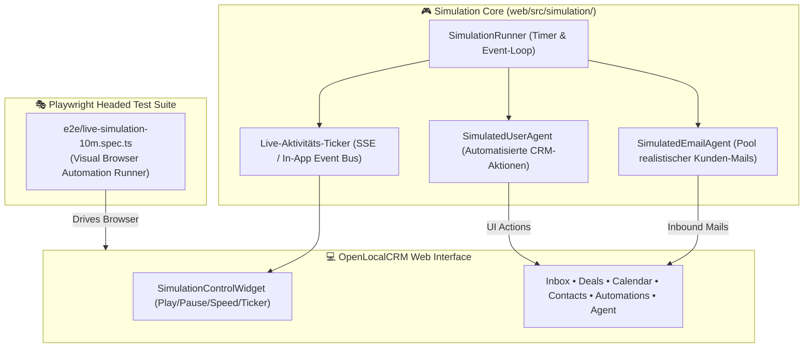

# 🧪 Spezifikation & Design: Live-Nutzer- & E-Mail-Simulations-Suite (10-Minuten Realtime Engine)

Dieses Dokument spezifiziert die Architektur und Implementierung der **kontinuierlichen Live-Simulations-Suite** für OpenLocalCRM. Sie ermöglicht es, das gesamte CRM über mehrere Minuten mit realistischen Benutzeraktionen und asynchronen E-Mail-Agenten live zu bespielen und in Echtzeit zu beobachten.

---

## 🎯 1. Ziele & Anforderungen

1. **Simulierter E-Mail-Agent (Inbound Generator):**
   - Generiert in regelmäßigen, realistischen Intervallen (z. B. alle 15–30 Sekunden) authentische deutsche Kunden-E-Mails (Photovoltaik-Anfragen, Gewerbespeicher, UWG § 7 Einwilligungen, Zählerdaten, Störungsmeldungen, Terminbestätigungen).
   - Einspeisung erfolgt asynchron über das Posteingangs- und SSE-System.

2. **Simulierter Vertriebs-Nutzer (Virtual Sales Agent):**
   - Agiert wie ein echter Vertriebsmitarbeiter im System:
     1. **E-Mail Inbox:** Liest neue E-Mails, weist thematische Tags zu, lässt Gemma 12B den Antwortentwurf formulieren und versendet Antworten.
     2. **Deals & Pipeline:** Erstellt neue Deals aus qualifizierten Leads, verschiebt Deals per Drag-and-Drop zwischen den Kanban-Phasen (Lead ➔ Angebot ➔ Verhandlung ➔ Gewonnen).
     3. **Termine & Kalender:** Bucht Vor-Ort-Termine für Closer/Setter, generiert RFC 5545 `.ics`-Dateien.
     4. **Click-to-Call Telefonie:** Startet simulierte Anrufe, lässt den Timer laufen, wählt Dispositionen (`Erreicht`, `Mailbox`) und speichert Notizen.
     5. **Automations & HITL:** Prüft anstehende Workflow-Schritte und erteilt Human-in-the-Loop Freigaben.
     6. **Web-Recherche & Evidence-Ledger:** Recherchiert Kunden-Websites und bestätigt extrahierte Fakten.

3. **Zwei Betriebsmodi:**
   - **Modus A (In-App Live-Simulator):**
     - Schwebendes Steuerungs-Widget in der Web-App (unten links oder Header) mit `Start`, `Pause`, `Geschwindigkeit` (1x, 2x, 5x, 10x) und einem **Live-Aktivitäts-Ticker** ("📨 E-Mail empfangen", "🤝 Deal verschoben", "📞 Anruf protokolliert").
     - Aktualisiert den Zustand der App live über React Query Cache und SSE.
   - **Modus B (Standalone Headed Playwright Runner):**
     - CLI-Befehl `make simulate` bzw. `pnpm simulate:10m`, der ein echtes sichtbares Browserfenster öffnet und für bis zu 10 Minuten (bzw. `--duration=600`) kontinuierlich navigiert, klickt, Formulare ausfüllt und den Bildschirm bespielt.

---

## 🏛️ 2. Architektur & Komponenten



---

## 📋 3. Szenarien-Pool des E-Mail-Agenten

Der E-Mail-Agent verfügt über einen Pool an realistischen Szenarien:

| Szenario-ID | Absender & Firma | Betreff & Thema | Enthaltene Fakten & PII |
|---|---|---|---|
| `SCENARIO_PV_30KWP` | Dr. Michael Weber (Energie Südwest GmbH) | Anfrage 30 kWp Gewerbedach mit 20 kWh Speicher | 350 m² Dachfläche, IBAN: DE893704... |
| `SCENARIO_D2D_METER` | Sabine Mustermann (Privatkunde) | Unterlagen & Zählernummer für PV-Angebot | Zähler: 1EMH00998877, 4.800 kWh, UWG Opt-In |
| `SCENARIO_SERVICE_FAULT` | Thomas Becker (Bauunternehmung Becker) | Störung Wechselrichter Fehler E-04 | Dringend, Sentiment NEGATIVE |
| `SCENARIO_QUOTE_ACCEPT` | Claudia Richter (Richter Logistik) | Annahme Angebot & Terminvereinbarung | Deal WON Vorbereitung |
| `SCENARIO_REVOCATION` | Frank Schulz (Privatkunde) | Widerruf nach § 355 BGB binnen 14 Tagen | Test für Widerrufs-Behandlung |

---

## ⚙️ 4. Steuerung & CLI-Kommandos

- **In-App:** Klick auf den Simulations-Button in der Menüleiste.
- **Terminal (Headed Playwright):**
  ```bash
  # 10-Minuten sichtbare Live-Simulation im Browser starten:
  make simulate

  # Schneller 2-Minuten Demolauf:
  pnpm test:simulate -- --duration 120
  ```

---

## 🔍 5. Verifikations-Plan

1. **Automatisierter Testlauf:** Playwright-Test verifiziert, dass die Simulations-Engine ohne Ausnahmen über mehrere Zyklen durchläuft.
2. **Visuelle Beobachtung:** Öffnen der Live-Simulation im Browser, Überprüfung von Live-Ticker, Inbound-E-Mail-Zähler und Deal-Verschiebungen.
3. **Dokumentation:** Integration in [`docs/USER_GUIDE_AND_PLAYBOOKS.md`](../../USER_GUIDE_AND_PLAYBOOKS.md) und `Makefile`.
