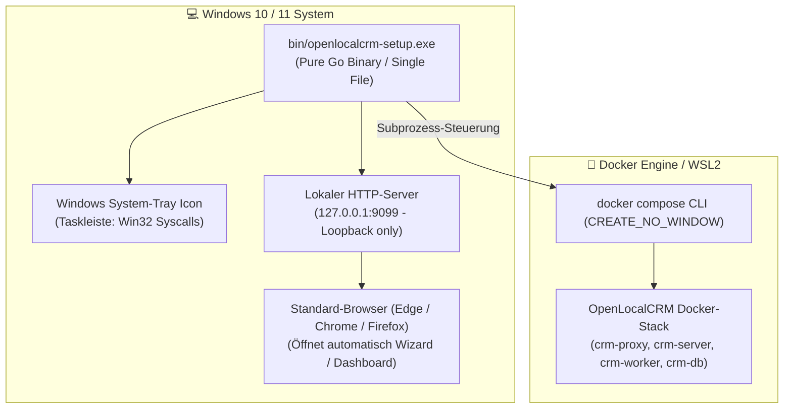
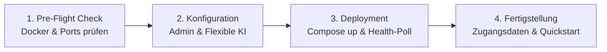
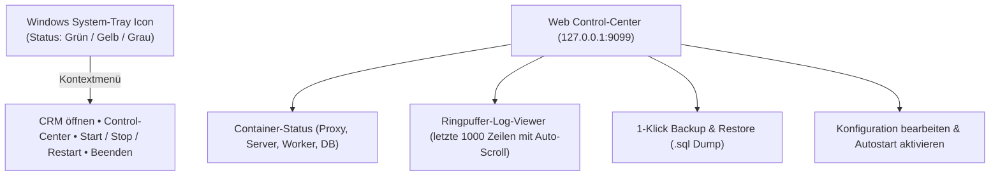

# 🪟 Spezifikation: Windows Setup- & Mini-Control-Center Binary für OpenLocalCRM

- **Datum:** 2026-09-14
- **Status:** Entwurf & Validiert (Bereit für Implementierungsplan)
- **Autor / Rollout:** OpenLocalCRM Core Engineering
- **Ziel-Plattform:** Microsoft Windows 10 / 11 / Server (x64 / amd64)
- **Ziel-Binary:** `bin/openlocalcrm-setup.exe` (Standalone Go Binary, CGO-frei, Alias: `mavalio-setup.exe`)

---

## 1. Ausgangslage & Zielsetzung

### 1.1 Problemstellung
OpenLocalCRM (Single-Tenant Edition v3) besteht aus mehreren eng verzahnten Komponenten:
- Einem Caddy Reverse Proxy (Ports :80/:443)
- Einem Go Chi HTTP Server mit eingebettetem React 18 SPA Frontend (:8080)
- Einem River Background Job Worker Daemon (:8081)
- Einer PostgreSQL 16 Datenbank mit `pgvector` und automatischen Migrationen (00001–00008)

Für Windows-Anwender (Vertriebsleiter, KMUs, Vorführ-Szenarien) erfordert die Ersteinrichtung bisher manuelle Schritte wie Git-Clone, Umgebungsvariablen-Konfiguration (`.env`), Schlüsselgenerierung (Ed25519) und Docker-Compose-Aufrufe im Terminal. 

### 1.2 Zielsetzung
Bereitstellung eines eigenständigen, lauffähigen Windows-Binaries (`openlocalcrm-setup.exe`, Alias: `mavalio-setup.exe`), das:
1. Den Anwender per moderner grafischer Weboberfläche (im Standard-Browser geöffnet) durch die vollständige Ersteinrichtung führt.
2. Alle Systemprüfungen (Docker Desktop Status, Port-Kollisionen auf Port 80/8080, RAM) automatisiert durchführt und bei Problemen verständliche 1-Klick-Lösungen anbietet.
3. Die flexible Anbindung von KIs (lokales Ollama oder beliebige Cloud-/OpenAI-kompatible Endpunkte via URL & API-Key) ermöglicht und live testet.
4. Nach erfolgreicher Installation als schlankes **Mini-Control-Center mit Windows-System-Tray-Icon** weiterläuft, um Container zu starten, zu stoppen, Live-Logs anzuzeigen und 1-Klick-Backups zu erstellen.
5. Vollständig in purem Go (ohne CGO) implementiert ist, sodass es sich direkt auf macOS/Linux mit `GOOS=windows GOARCH=amd64` bauen lässt.

---

## 2. Systemarchitektur & Komponenten



### 2.1 Paketstruktur im Repository
```text
openlocalcrm/
├── cmd/
│   └── setup-launcher/
│       ├── main.go           # Entrypoint, Port-Findung, Signal-Handling
│       ├── tray_windows.go   # Win32 Syscalls für System-Tray (//go:build windows)
│       └── tray_other.go     # Plattform-Stubs für macOS/Linux (//go:build !windows)
├── internal/
│   └── launcher/
│       ├── engine.go         # Docker Compose CLI Wrapper (up, down, stop, restart, ps, logs)
│       ├── preflight.go      # Pre-Flight Checks: Docker Daemon Ping, Port 80/8080 Scan, RAM
│       ├── ai_probe.go       # Live-Verbindungstest für KI-Endpunkte (Ollama & OpenAI-kompatibel)
│       ├── config.go         # .env-Generator, Host-Gateway URL Mapping, Ed25519-Keys
│       ├── server.go         # REST API & SSE Server (gebunden an 127.0.0.1)
│       └── ui/
│           ├── embed.go      # //go:embed ui/* (Zero-Dependency HTML/CSS/JS)
│           ├── index.html    # Reaktives Single-Page Setup- & Control-Center Interface
│           ├── style.css     # Responsive Slate/Emerald Design passend zum CRM
│           └── app.js        # Setup-State Machine, SSE Log-Streaming, Live-Tests
├── bin/
│   ├── openlocalcrm-setup.exe        # Kompiliertes Windows-Release-Binary (Alias: mavalio-setup.exe)
│   └── openlocalcrm-setup-debug.exe  # Debug-Binary mit Konsole
├── bin/
│   ├── openlocalcrm-setup.exe
│   └── openlocalcrm-setup-debug.exe
└── Makefile                  # Windows Build-Targets (build-windows, build-windows-debug)
```

---

## 3. Detaillierter Ablauf des Setup-Wizards

Befindet sich das System im Zustand „Nicht eingerichtet“ (keine gültige `.env` oder keine aktiven Container), startet automatisch der **4-stufige Setup-Assistent**:



### Schritt 1: Systemprüfung & Voraussetzungen (Pre-Flight)
* **Docker Desktop Check:**
  * Prüft die Named Pipe `\\.\pipe\docker_engine` bzw. `docker version`.
  * *Docker läuft:* Grüner Status, sofort bereit.
  * *Docker installiert, aber gestoppt:* Gelbe Warnung mit Button **„Docker Desktop starten“**.
  * *Docker fehlt:* Roter Status mit Button **„Docker Desktop via winget installieren“** (`winget install Docker.DockerDesktop`) und offiziellem Download-Link.
* **Port-Verfügbarkeit:**
  * Prüft TCP-Ports 80 und 8080 mittels `net.Listen`.
  * Ist Port 80 durch Windows IIS / Skype belegt, schlägt der Assistent automatisch Port 8080 als Ausweich-Port vor (`APP_PORT=8080`).
* **Hardware-Ressourcen:**
  * Überprüft den verfügbaren Arbeitsspeicher (Gesamtbudget des Stacks < 420 MB RAM).

### Schritt 2: Grundeinstellungen & Flexible KI-Anbindung
* **Betriebsmodus-Auswahl:**
  * 🟢 *Produktiv-Stack (Empfohlen):* Vollständiger Stack mit PostgreSQL 16 + pgvector, Caddy und Worker.
  * ⚡ *Demo-Modus:* Null-Datenbank-Modus (komplett im RAM) für unverbindliche Kurztests.
* **Administrator-Zugang:**
  * Admin-E-Mail (Standard: `admin@openlocalcrm.local` oder eigene Firmenadresse).
  * Initiales Admin-Passwort: Eingabefeld mit Kennwortstärke und **„Sicheres Passwort generieren“**-Schaltfläche.
* **Flexible KI-Integration:**
  * **Option A: Lokales Ollama:** Base URL `http://host.docker.internal:11434`, Modellname (z. B. `gemma2:12b`, `llama3.1`). Automatisches Umschreiben von `localhost` zu `host.docker.internal` für Docker-Netzwerk-Transparenz.
  * **Option B: OpenAI & OpenAI-kompatibel:** Beliebige Base URL (z. B. `https://api.openai.com/v1`, OpenRouter, vLLM, Groq, LiteLLM), API-Key und Modellname (`gpt-4o-mini`, etc.).
  * **Option C: Google Gemini / Anthropic Claude:** API-Key & Modellname.
  * **Option D: Keine KI:** Standard-Triage ohne externes Sprachmodell.
  * **🧪 Live-Verbindungstest:** Button **„KI-Verbindung testen“** validiert den Endpunkt und API-Key in Echtzeit vor dem Speichern.

### Schritt 3: Automatisierte Bereitstellung (Live-Deployment)
* Beim Klick auf **„Installation jetzt starten“**:
  1. Erzeugen der `.env`-Datei mit kryptographisch zufälligen Passwörtern, `JWT_SECRET` und Portzuweisungen.
  2. Anlegen lokaler Datenordner (`./data/postgres`, `./data/storage/keys`).
  3. Ausführen von `docker compose up -d` im Hintergrund mit `CREATE_NO_WINDOW`.
  4. **Live-Log-Streaming:** Übertragung des Compose-Outputs via Server-Sent Events (SSE) in eine Terminal-Konsole im Browser.
  5. **Health-Check-Polling:** Zyklische Abfrage von `http://localhost:<port>/api/v1/health` alle 2 Sekunden, bis `"status": "healthy"` zurückgegeben wird.

### Schritt 4: Abschluss & Quick-Start
* Visuelle Bestätigung: „OpenLocalCRM wurde erfolgreich eingerichtet!“
* Zusammenfassung der Zugangsdaten (URL, E-Mail, Passwort) mit Kopierfunktion.
* Button **„Desktop-Verknüpfung anlegen“** (erzeugt `OpenLocalCRM.url` auf dem Windows-Desktop).
* Primär-Button **„CRM im Browser öffnen & anmelden“**.

---

## 4. Mini-Control-Center & Windows System-Tray

Sobald die Installation abgeschlossen ist, wechselt das Binary in den **Control-Center-Modus**:



### 4.1 System-Tray-Funktionen
* **Status-Icon:**
  * 🟢 *Grün:* Alle Container aktiv und API meldet `healthy`.
  * 🟡 *Gelb:* Container starten oder Health-Check aktiv.
  * ⚪ *Grau:* Container gestoppt.
* **Kontextmenü:**
  * *OpenLocalCRM im Browser öffnen*
  * *Control-Center öffnen*
  * *Dienste starten (`docker compose up -d`)*
  * *Dienste anhalten (`docker compose stop`)*
  * *Dienste neu starten (`docker compose restart`)*
  * *Beenden* (mit Dialog: Container im Hintergrund weiterlaufen lassen oder ebenfalls stoppen).

### 4.2 Web-basiertes Control-Center
* **Status-Ampel:** Zeigt Live-Status, Uptime und RAM-Verbrauch der 4 Container (`crm-proxy`, `crm-server`, `crm-worker`, `crm-db`).
* **Log-Konsole:** Integrierter Terminal-Viewer mit Ringpuffer (max. 1.000 Zeilen), Log-Download und Filter nach Container.
* **1-Klick-Backup & Restore:**
  * Backup: Führt `pg_dump` im PostgreSQL-Container aus und legt die Datei in `./backups/` ab.
  * Restore: Erlaubt das Einspielen eines `.sql`-Backups mit Sicherheitsbestätigung.
* **Autostart:** Schalter für automatischen Start des Launchers beim Windows-Boot via Windows Autostart-Verzeichnis (`shell:startup`).

---

## 5. Technische Härtung & Windows-Spezifika

1. **Kein schwarzes Konsolenfenster (`CREATE_NO_WINDOW` & `-H=windowsgui`):**
   * Binary wird mit `-ldflags="-H=windowsgui"` gelinkt.
   * Alle Subprozesse (`docker`, `winget`) setzen `syscall.SysProcAttr{HideWindow: true, CreationFlags: 0x08000000}`.
2. **Sicherheits-Isolation:**
   * Der integrierte HTTP-Server bindet **ausschließlich an `127.0.0.1`** (Loopback), niemals an `0.0.0.0`.
   * CSRF-Schutz durch lokale Sitzungstoken.
3. **API-Key & Passwort-Schutz:**
   * Maskierte Eingabefelder in der UI.
   * Sämtliche API-Keys werden in Logs und SSE-Streams unkenntlich gemacht (`sk-***`).
4. **Docker Host-Gateway:**
   * In `docker-compose.yml` wird sichergestellt, dass `extra_hosts: ["host.docker.internal:host-gateway"]` konfiguriert ist, damit Linux-Container lokale Windows-Dienste (wie Ollama) unter `host.docker.internal` ansprechen können.
5. **Re-Run-Schutz:**
   * Bereits bestehende Datenbanken (`./data/postgres`) oder `.env`-Dateien werden bei erneutem Ausführen niemals ungefragt überschrieben.

---

## 6. Build-Prozess & Makefile

Erweiterung des `Makefile` im Projekt-Root:

```makefile
# Windows Release Binary (Pure Go, ohne CGO, kein Konsolenfenster)
build-windows:
	GOOS=windows GOARCH=amd64 go build -ldflags="-w -s -H=windowsgui" -o bin/openlocalcrm-setup.exe ./cmd/setup-launcher
	cp bin/openlocalcrm-setup.exe bin/mavalio-setup.exe

# Windows Debug Binary (mit sichtbarer Konsole für detaillierte Ausgaben)
build-windows-debug:
	GOOS=windows GOARCH=amd64 go build -ldflags="-w -s" -o bin/openlocalcrm-setup-debug.exe ./cmd/setup-launcher
	cp bin/openlocalcrm-setup-debug.exe bin/mavalio-setup-debug.exe
```

---

## 7. Verifikations- & Testplan

### 7.1 Automatisierte Unit- & Integrationstests
* `internal/launcher/preflight_test.go`:
  * Testet Erkennung freier vs. belegter Ports.
  * Testet Parsing von `docker version` und `docker compose version`.
* `internal/launcher/config_test.go`:
  * Validiert Generierung der `.env`-Datei.
  * Testet die automatische Übersetzung von `localhost` zu `host.docker.internal`.
* `internal/launcher/ai_probe_test.go`:
  * Simuliert mittels `httptest.Server` OpenAI- und Ollama-Antworten sowie Fehlercodes (401 Unauthorized, Connection Refused).
* `internal/launcher/server_test.go`:
  * Testet alle REST-Endpunkte des Setup- & Control-Servers (`/api/status`, `/api/preflight`, `/api/ai/test`, `/api/setup`, `/api/control/*`).

### 7.2 Kompilierungs- & Integritäts-Check
* Ausführen von `make build-windows`.
* Überprüfung des resultierenden Binaries `bin/openlocalcrm-setup.exe` auf gültige Windows PE-Header (`MZ` / `PE\0\0`).
* Ausführen auf macOS via `go run ./cmd/setup-launcher`, um die Browser-Bedienung und die Weboberfläche interaktiv zu verifizieren.
