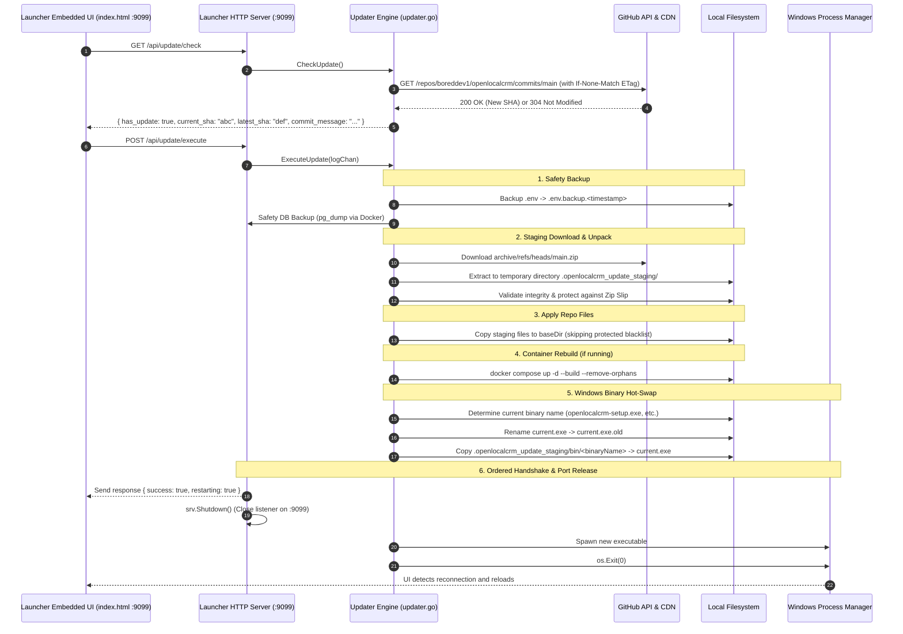

# Design Specification: GitHub Self-Updater for OpenLocalCRM Setup Launcher & Repository Files

**Date:** 2026-09-16  
**Status:** In Review (Self-Reviewed & Corrected)  
**Author:** Pair Programming (Antigravity & User)

---

## 1. Executive Summary & Problem Statement

The OpenLocalCRM Windows Setup & Control Launcher (`openlocalcrm-setup.exe` / `openlocalcrm-setup-debug.exe`) serves as the central control plane for end-users, managing Docker stacks, backups, password resets, and updates on Windows systems on `http://127.0.0.1:9099`.

To ensure that end-users always receive bug fixes, security patches, updated Caddy/Docker configs, and frontend improvements without having to manually download new releases or install Git:
1. The launcher binary must be capable of self-updating directly from GitHub.
2. The launcher must update all repository/project files (`docker-compose.yml`, `Caddyfile`, web assets, configs) in-place.
3. The process must be fully automated, resilient against network failures, rate limits, and Windows executable file-locking, while strictly safeguarding customer data (`.env`, backups, volumes).

---

## 2. Goals & Non-Goals

### Goals
- **Self-Updating Executable:** Download the newest matching launcher binary (`openlocalcrm-setup.exe`, debug variant, or legacy `mavalio-setup.exe`) from GitHub and perform a live in-place replacement on Windows using the rename-and-relaunch pattern.
- **Repository File Sync:** Download and extract the latest repository archive (`main.zip`) from GitHub without requiring Git to be installed on the host.
- **Strict Data Protection:** Never overwrite `.env`, `.env.local`, `backups/`, `.git/`, or volume mounts.
- **Automated Safety Backups:** Automatically trigger a database backup (`openlocalcrm_backup_pre_update_*.sql`) and `.env.backup` before applying file or container changes.
- **Rate-Limit Resilience:** Use HTTP `If-None-Match` (ETags), in-memory caching, and graceful fallback to avoid exhausting GitHub's 60 req/hr unauthenticated rate limit.
- **Zero Port Conflict:** Sequence the graceful shutdown of the old HTTP server on `:9099` *before* spawning the new process to eliminate socket bind conflicts.
- **Zero Downtime Container Sync:** When Docker containers are active, automatically rebuild and restart them (`docker compose up -d --build --remove-orphans`) after files are updated.
- **User Interface:** Provide an automatic update check on launcher startup, a manual "Nach Updates suchen" / "Jetzt aktualisieren" button in the embedded Launcher UI (`internal/launcher/ui/`), and live progress logging.

### Non-Goals
- Supporting non-GitHub source control providers (GitLab, Bitbucket).
- Replacing Docker Compose with custom container runtimes.

---

## 3. Architecture & Update Pipeline



---

## 4. Detailed Component Specifications

### 4.1. Version & Commit Detection
- **Embedded Metadata:** Build metadata is injected into `internal/launcher` via `-ldflags`:
  - `BuildCommit` (e.g. `57a2879`)
  - `BuildDate` (e.g. `2026-09-16T12:00:00Z`)
  - Fallback: Local file `.version` in `baseDir`.
- **Remote Endpoint:** `https://api.github.com/repos/boreddev1/openlocalcrm/commits/main`
- **Rate-Limiting Strategy:**
  - Cache response in memory for 15 minutes.
  - Store last ETag in memory. On subsequent checks, pass `If-None-Match: <etag>`. If GitHub responds with `304 Not Modified`, return cached update state with zero rate limit penalty.
  - If rate limited (HTTP 403), return graceful status `{ "rate_limited": true, "has_update": false }` without throwing errors.
  - User-Agent header: `OpenLocalCRM-Updater/3.0 (+https://github.com/boreddev1/openlocalcrm)`.

### 4.2. Transactional Staging & Zip Slip Protection
1. All files from `archive/refs/heads/main.zip` are downloaded into an isolated temporary folder:
   `filepath.Join(baseDir, ".openlocalcrm_update_staging")`
2. **Zip Slip Prevention:**
   Each entry in the ZIP is strictly sanitized and verified:
   ```go
   cleanTarget := filepath.Clean(filepath.Join(targetDir, relPath))
   if !strings.HasPrefix(cleanTarget, filepath.Clean(targetDir) + string(os.PathSeparator)) {
       return fmt.Errorf("illegal path traversal detected in zip: %s", relPath)
   }
   ```
3. **Dynamic Root Prefix Stripping:**
   GitHub archives place all contents inside a root folder named `<repo>-<ref>` (e.g. `openlocalcrm-main/`). The extractor dynamically determines and strips this single leading segment.

### 4.3. Protected Paths Blacklist
When copying from `.openlocalcrm_update_staging` to `baseDir`, the following files/directories are strictly skipped to prevent user data loss:
- `.env`
- `.env.local`
- `.env.production`
- `backups/`
- `data/`
- `storage/`
- `.git/`
- `*.old`
- `openlocalcrm-setup.log`
- Any custom certificates in `caddy/certs/`

### 4.4. Binary Detection & Windows In-Place Hot-Swap
The updater respects whatever binary variant is currently executing:
1. Determine `currentExe, err := os.Executable()`.
2. Inspect `exeName := filepath.Base(currentExe)`:
   - If `exeName` is `mavalio-setup.exe` or `mavalio-setup-debug.exe`, look for matching legacy binary in staging, falling back to `openlocalcrm-setup.exe`.
   - If `exeName` is `openlocalcrm-setup-debug.exe`, match `openlocalcrm-setup-debug.exe`.
   - Otherwise, default to `openlocalcrm-setup.exe`.
3. Rename running executable:
   `oldExe := currentExe + ".old"`
   Remove any existing stale `oldExe` (using retry loop).
   `os.Rename(currentExe, oldExe)` (Windows allows renaming a running executable).
4. Copy matching new binary from staging `bin/<exeName>` to `currentExe`.
5. Ordered shutdown & spawn:
   ```go
   // 1. Shutdown HTTP server to release port 9099
   shutdownCtx, cancel := context.WithTimeout(context.Background(), 2*time.Second)
   defer cancel()
   _ = srv.Shutdown(shutdownCtx)

   // 2. Spawn new process
   cmd := exec.Command(currentExe)
   cmd.Dir = baseDir
   _ = cmd.Start()

   // 3. Exit current process
   os.Exit(0)
   ```
6. On startup, the launcher scans `filepath.Dir(currentExe)` for `*.old` files and unlinks them.

### 4.5. Automatic Cleanup & Rollback
- If download or staging extraction fails:
  - Remove `.openlocalcrm_update_staging/`.
  - Abort update; existing binaries and files remain 100% untouched.
- If binary replacement fails:
  - If `*.old` exists and new file is missing or corrupted, rename `.old` back to original.

---

## 5. HTTP API Endpoints

### `GET /api/update/check`
- **Response (200 OK):**
  ```json
  {
    "has_update": true,
    "current_commit": "57a2879",
    "latest_commit": "a1b2c3d",
    "commit_message": "feat: improvements to launcher",
    "commit_date": "2026-09-16T12:00:00Z",
    "checked_at": "2026-09-16T12:03:00Z",
    "rate_limited": false
  }
  ```

### `POST /api/update/execute`
- Triggers the update pipeline in background.
- Streams live progress lines into the existing Launcher log stream (`/api/logs`).
- **Response (200 OK):**
  ```json
  { "success": true, "message": "Update initiated" }
  ```

---

## 6. Frontend & User Experience Integration

The Launcher UI is embedded into the executable via Go `embed` in `internal/launcher/ui/` (`index.html`, `app.js`, `style.css`):

1. **Header Navigation:**
   - Add update badge next to `#system-overall-badge`:
     - `<span id="launcher-update-badge" class="badge-version">v3.0 (Aktuell)</span>`
     - When update available: `<button id="btn-update-now" class="btn btn-warning btn-sm" onclick="openUpdateModal()">⚡ Update verfügbar</button>`
2. **Steuerungszentrale (`#control-section`):**
   - Add a dedicated "🔄 Nach Updates suchen" button in the action bar.
   - Update confirmation modal with summary of pending changes.
3. **Smooth Reconnection:**
   - During restart, `app.js` polls `/api/status` every 1.5 seconds. As soon as the newly spawned launcher responds, the browser tab automatically refreshes.

---

## 7. Verification Plan

1. **Unit & Integration Tests:**
   - `internal/launcher/updater_test.go`:
     - Test ZIP extractor with Zip Slip malicious relative paths (must return error).
     - Test protected blacklist filters (assert `.env` and `backups/` are skipped).
     - Test commit comparison logic and fallback behavior.
2. **Build Validation:**
   - `make build-windows` and `make build-windows-debug` build with embedded commit hash.
   - `go test ./...` passes 100%.
3. **Manual Simulation:**
   - Query `/api/update/check` and verify response structure.
   - Verify staging folder creation and cleanup.
